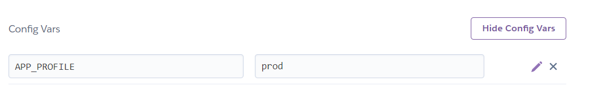

<div align="center">
<h1>Thymeleaf Website Template</h1>
</div>
<p align="center"> You can access the <a href="https://thymeleaf-website-template.herokuapp.com/home">template by clicking here</a></p>

<div align="center">
<h2>Powered by</h2>
<a href="https://github.com/andreltcarvalho"><br /><sub><b>
André Luís Carvalho</b></sub></a>
</div>

:thinking: As a Java Backend developer, without much trouble with creating projects. Was
infinite doubts:

```text
- what technology to learn for Frontend?
- how to integrate this technology with the backend?
- which database to use?
- how to do authentication and authorization?
- which architecture to use?
- how to upload this application on a real server?
```

After some time of study and analysis, I came across Thymeleaf, a frontend framework that
from now on with Spring Boot, and then I decided to study and learn.

```text
After months of much study in research within blogs and forums, I managed to gather all
the knowledge acquired in a single template, with all the essential components for a website.
```

<h2 align="left"> Technologies Used in the Template</h2>
<ul>
<li>Thymeleaf</li>
<li>CSS</li>
<li>Bootstrap</li>
<li>Spring Boot </li>
<li>Spring MVC </li>
<li>Spring Data</li>
<li>Spring Safety</li>
<li> Database: Postgres / MySQL </li>
</ul>

<h2>How to use this template?</h2>

1: make sure these items working on your computer:

```text
1.1: Java.
1.2: Specialist.
1.3: GIT.
1.4: MySQL.
1.5: IDE(Eclipse, STS or IntelliJ).
```

2: Copy/Clone the template code into a new project placed when administering from Github.

3: Create a schema/database in MySQL, right click on that Schema and select "Set as Default", then
update the application-test.properties file in the following property:

```properties
spring.datasource.url=jdbc:mysql://localhost:3306/yourSchemaNameHere
```

4: If you use IntelliJ, select the Maven menu of choice and choose the command mvn clean install.

```text
If you don't use this IDE, just run the command "mvn clean install" inside
from the root folder of your project.
```

<h3>There, your template is set up!</h3>

```text
Just run the AppMain class inside the src package -> main -> java -> AppMain.Java
Run as -> Spring Boot Application.
```

<h3>Well, I'd like to go further, how about doing the first deploy?</h3>

```text
Amazingly, which is MUCH simpler, you will need:
```

- an account created on [Heroku](https://www.heroku.com/)
- after creating the account, create a new app on the platform by clicking [Here](https://dashboard.heroku.com/new-app)
- after creating the app, go to the "Deploy" tab and click "Connect to Github"
- below a text will appear and you type the name of your clear, attention field:
  the name has to match what's on Github to work.
- click on "search", then "connect".
- after connecting, scroll down to the bottom of the screen, and in the "Manual Deploy" tab, choose a branch and click on "Deploy Branch".
- now you will access the "Settings" tab, on the "Re Config Vars" button and then click on the following line:
  
- Okay, now your local project will use your MySQL, and the heroku project will use its own PostgreSQL server.

<h3>Done! Now just go back up to the top of the page and click on "Open App"!</h3>

```text
From these tips you can now develop your website, and every time you
update your code on Github, just go to heroku and click Deploy again!
```

If you have any questions, feel free to call me, I will gladly help you!
Just access my profile and there you have my social networks, hugs!